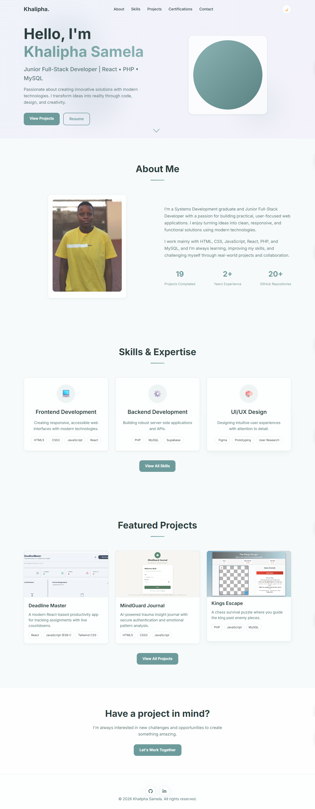
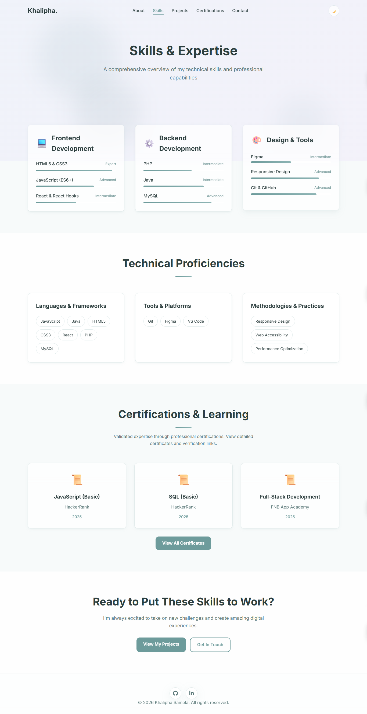
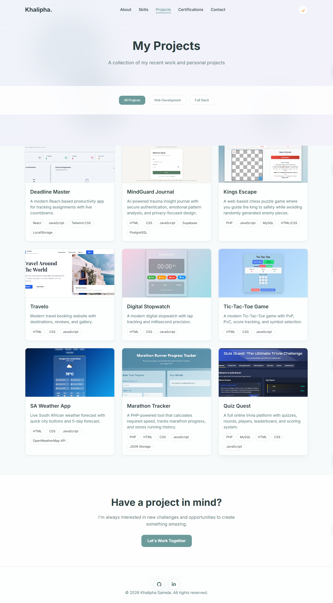
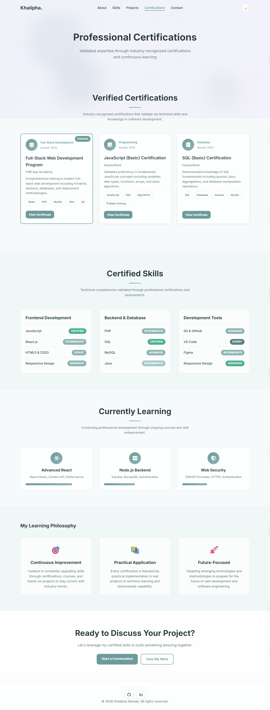
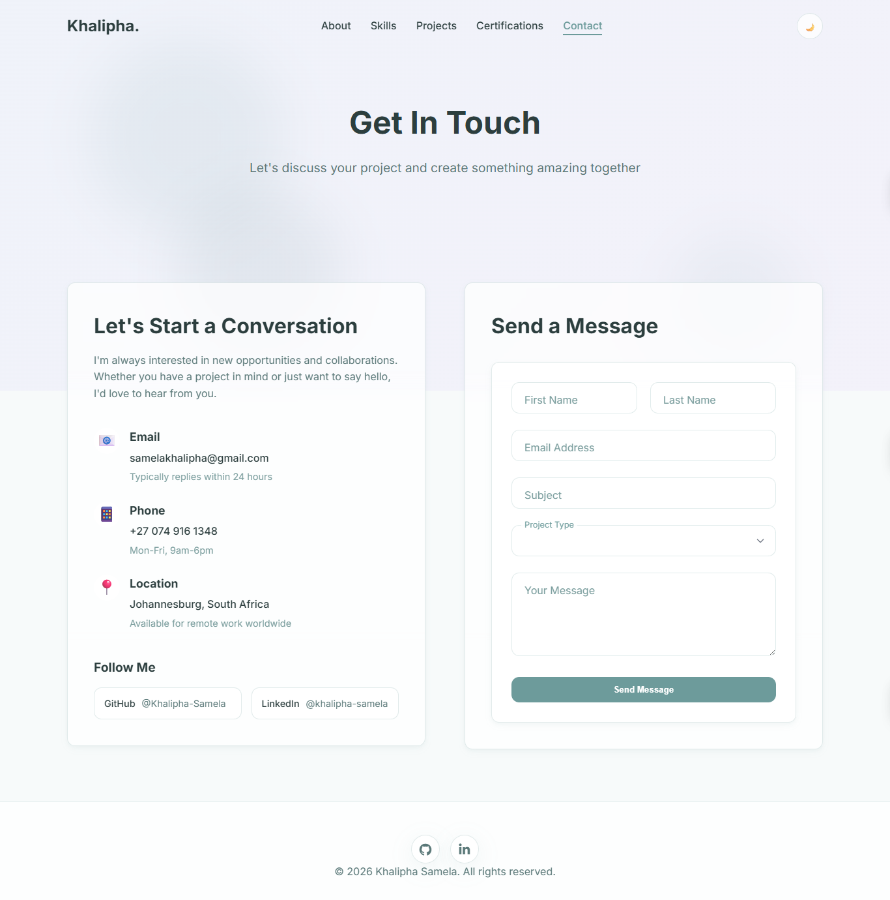

# Khalipha Samela Portfolio Website

A modern, responsive portfolio website showcasing my skills, projects, and certifications as a Full-Stack Developer.

---

## 🌐 Live Demo
[View Live Portfolio](https://khalipha-portfolio.vercel.app/) 

---

## ✨ Features
- **Fully Responsive** – Works on mobile, tablet, and desktop
- **Dark/Light Theme** – Toggle between themes
- **Interactive Animations** – Smooth scroll, hover effects, and particle background
- **Project Showcase** – Dynamic project filtering and modal previews
- **Skills Visualization** – Animated progress bars and proficiency tags
- **GitHub Integration** – Fetches repository stats dynamically
- **Contact Form** – Functional contact form with validation

---

## 🛠️ Tech Stack
- **Frontend:** HTML5, CSS3, JavaScript (ES6+)
- **Styling:** Custom CSS with CSS Variables, Flexbox, Grid
- **Fonts:** Google Fonts (Inter), Font Awesome Icons
- **Hosting:** Vercel 
- **Additional:** GitHub API, Formspree (contact form)

---

## 📁 Project Structure
```
Portfolio
├─ about.html
├─ assets
│  ├─ css
│  │  └─ style.css
│  ├─ docs
│  │  └─ resume.pdf
│  ├─ images
│  │  ├─ deadline-master-thumbnail.png
│  │  ├─ Kings-Escape.png
│  │  ├─ marathon-thumbnail.png
│  │  ├─ mindguard-thumbnail.png
│  │  ├─ profile.jpg
│  │  ├─ quizquest-thumbnail.png
│  │  ├─ sa-weather-thumbnail.png
│  │  ├─ stopwatch-thumbnail.png
│  │  ├─ TicTacToe.png
│  │  └─ Travelo.png
│  └─ js
│     ├─ certificates.js
│     ├─ contact.js
│     ├─ github-stats.js
│     ├─ projects.js
│     ├─ script.js
│     └─ skills.js
├─ certificates.html
├─ contact.html
├─ images
├─ index.html
├─ projects.html
└─ skills.html

```

---

## 🚀 How to Run Locall
1. **Clone the repository**
   ```bash
   git clone https://github.com/Khalipha-Samela/portfolio.git
   cd portfolio

2. **Open in browser**
- Simply open ```index.html``` in your browser
- For live reload during development, use a local server (e.g., VS Code Live Server)

3. **Customize for your use**
- Update ```index.html``` and other pages with your personal info
- Replace GitHub username in ```github-stats.js```
- Update project data in ```projects.js```
- Change colors and fonts in ```style.css```

---

## 📸 Screenshots

 <br>
 <br>
 <br>
 <br>


---

## 📄 Pages Overview

1. **Home** (```index.html```)
- Hero section with introduction
- About me with GitHub stats
- Skills overview
- Featured projects
- Call-to-action section

2. **About** (```about.html```)
- Personal journey and story
- Core values
- Technical toolkit
- Experience & education timeline
- Resume download option

3. **Skills** (```skills.html```)
- Categorized skill bars (Frontend, Backend, Tools)
- Technical proficiencies with tags
- Certifications preview
- Interactive progress animations

4. **Projects** (```projects.html```)
- Filterable project grid
- Project cards with live demo & GitHub links
- Detailed project modals
- Technologies tags

5. **Certifications** (```certificates.html```)
- Verified certification cards
- Skills validation table
- Ongoing learning progress
- Learning philosophy

6. **Contact** (```contact.html```)
- Contact information card
- Functional contact form
- Social media links
- Location and availability

---

## 🔧 Customization

**Personal Information**
- Update ```meta``` tags in each HTML file
- Replace name, email, phone, and social links
- Change profile image in ```assets/images/```

**Projects**
- Edit ```projects.js``` to add/remove projects
- Update ```liveUrl``` and ```githubUrl``` for each project
- Add project thumbnails to ```assets/images/```

**Styling**
- Modify CSS variables in ```:root``` (inside ```style.css```) for colors
- Adjust font sizes, spacing, and breakpoints as needed
- Update gradients and background effects

---

## 📱 Responsive Breakpoints
- **Mobile:** < 768px
- **Tablet:** 768px – 1024px
- **Desktop:** > 1024px

---

## 🌟 Key JavaScript Functions
- ```initThemeToggle()``` – Theme switcher (light/dark)
- ```generateProjectCards()``` – Auto-generates project cards
- ```initProjectFilter()``` – Filters projects by category
- ```fetchAllRepos()``` – Fetches GitHub repository stats
- ```initSkillAnimations()``` – Animates skill bars on scroll

---

## 📬 Contact Form Setup
1. Go to **Formspree**
2. Create a free account and a new form
3. Update the ```action``` URL in ```contact.html``` with your Formspree endpoint
4. Test the form to ensure emails are delivered

---

## 📈 GitHub Stats Integration
The portfolio automatically fetches your public GitHub repositories count.
- Update ```GITHUB_USERNAME``` in ```github-stats.js``` to your username
- The count updates dynamically on the About section

---

## 🎨 Design Notes
- Clean, modern interface with subtle animations
- Accessibility-focused (semantic HTML, ARIA labels)
- Performance optimized (lazy loading, minimal dependencies)
- Consistent spacing and typography scale

---

## 📄 License
This project is open source and available under the MIT License.
